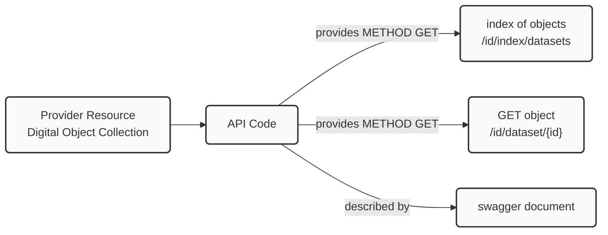
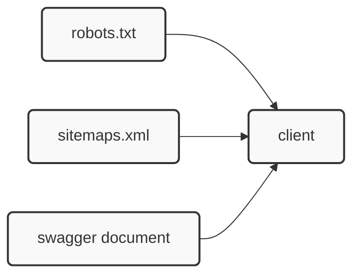
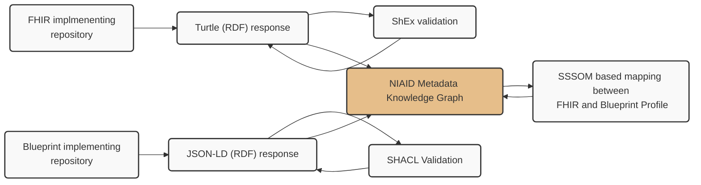

# API Reference

## About

This repo contains implementation details based on the NIH/NIAID Blueprint document titled: [A Blueprint for Including Digital Objects in the NIAID Data Ecosystem](https://docs.google.com/document/d/1y4Jzka6bcIZ_8yyxsJnOxGYrrRrqXv3n21sLJIZNUss/edit?tab=t.0#heading=h.3r4b53mh0wp9).

The goal is to provide a reference technical implementation for those interested in implementing the guidance in the Blueprint.

## Response Package

Before we talk about APIs or document URLs, we will address the response package that will be returned.  The Blueprint presents an approach where the response package is modeled in RDF and encoding in JSON-LD. This is similar to the optional FHIR response pattern using RDF and Turtle referenced in the [FHIR Interoperabiliy](#fhir-interopability) section below. 

Details of this encoding can be seen in the section __Supplemental Table 7. Example JSON-LD Encodings__ on page 23 of [A Blueprint for Including Digital Objects in the NIAID Data Ecosystem](https://docs.google.com/document/d/1y4Jzka6bcIZ_8yyxsJnOxGYrrRrqXv3n21sLJIZNUss/edit?tab=t.0#heading=h.3r4b53mh0wp9).

For developers, the best resource is the main reference site at [https://json-ld.org/](https://json-ld.org/). From there you can find libraries for most of the popular languages as well as an [interactive playground](https://json-ld.org/playground/) where you can play with editing JSON-LD or paste in examples from the Blueprint, this repo or others to explore with.  

Additionally, validation tools exist and are covered in the [SHACL Validation for Blueprint Profile](#shacl-validation-for-blueprint-profile) section later.  

## Reference Implementation Approach

The Blueprint presents a web architecture based approach to facilitate ease of implementation and scaling.  Some groups may have established API ecosystems and development and support resources in place already.  That case will be addressed later.  

For those starting fresh, this is an introduction.  The basic approach would be the establishment of an API/URL that can deliver the appropriate response package.

### Minimal Methods and Patterns

As this Blueprint describes a read-only pattern, the only HTTP verb we will be dealing with is GET.  This means any compliant service does need to expose things like POST, PUT, HEAD or any of the others.   

Given this, a minimum viable product (MVP) approach might look something like this.

First, we will want some ability to expose a catalog of the resources we want to have indexed.  A more architectural approach to this will be shown shortly in the [Optional Architectural Elements](#optional-architectural-elements) section.  However, we could also do this as an API call.    

Let's establish a set of URL patterns for our implementation.

```http request
/id/index/datasets
/id/dataset/{id}
```

Here we have used the prefix ```/id/``` simply to set this URL apart from the rest of our domain namespaces for URLs.   This is optional, and if you are using a top-level unique domain like api.example.org, then it wouldn't even be necessary.   For this document we will keep it. 

Visually this is something like




This collection of digital objects might be a GitHub repository, S3 objects store, Relational Database or any type of document/resource management approach.


#### Example

If we run the main.py program found in the server directory with 

```bash
uv run main.py
```


#### Catalog

We would use 

```http request
/id/index/datasets
```

to get a set of resources we wish to index.  Note; it is possible this could be quite large depending on how you, as an organization, have decided to expose your resources.  The __unit__ or __quantization__ of your resources might be quite fine or course depending on the use cases for your community.   If this set it large, it might be challenging for an API to dynamically respond to, and so you may wish to build this and provide it as a static pre-computed resource.  In that case you may want to use a sitemap as described in the following [Optional Architectural Elements](#optional-architectural-elements) section.

We can then see we can use a simple curl call like:

```bash
➜  apireference git:(master) ✗ curl http://192.168.202.58:8080/id/index/datasets
["http://127.0.0.1:8080/id/dataset/1","http://127.0.0.1:8080/id/dataset/3"]
```

Here the valid URLs are expressed with a localhost IP (127.0.0.1) so this will only work on your 
local machine.  


#### GET resource

This leaves us to implement

```http request
/id/dataset/{id}
```

as a means to get a dataset.  

```bash
➜  apireference git:(master) ✗ curl http://192.168.202.58:8080/id/dataset/1     
{
  "@context": "http://schema.org",
  "@type": "Dataset",
  "name": "Sample Dataset",
  "description": "This is a sample dataset."
}
```

Note if we look at our headers,  we can do something like

```bash
➜  apireference git:(master) ✗ curl -v http://192.168.202.58:8080/id/dataset/1 -o /dev/null
 
 ...
 
* Connected to 192.168.202.58 (192.168.202.58) port 8080
* using HTTP/1.x
> GET /id/dataset/1 HTTP/1.1
> Host: 192.168.202.58:8080
> User-Agent: curl/8.12.1
> Accept: */*
> 
* Request completely sent off
< HTTP/1.1 200 OK
< Server: Werkzeug/3.1.3 Python/3.13.1
< Date: Wed, 16 Jul 2025 16:24:13 GMT
< Content-Disposition: inline; filename=1.json
< Content-Type: application/ld+json
< Content-Length: 133
< Last-Modified: Sun, 13 Jul 2025 13:46:44 GMT
< Cache-Control: no-cache
< ETag: "1752414404.2917662-133-2897417769"
< Date: Wed, 16 Jul 2025 16:24:13 GMT
< Connection: close
< 
```

Here we see both the request and response headers.  Note the "Content-Type: application/ld+json" in the response header.  We could also configure out API service to content negotiate on the "Accept" header and allow our single URL to provide for various content types.  Such as being both a default HTML representation and a negotiated application/ld_json representation.  


### OpenAPI / SWAGGER

Talk about swagger here and why a swagger document for your service would be useful. 


### Optional Architectural Elements

* robots.txt 
* sitemap.xml (ala Google Dataset Search)





One advantage of this approach is that is a common pattern used by other aggregation services.  The largest among these is like the Google Dataset Search services.  If you establish a sitemap.xml referencing your resources, you can submit it to Google so that your resources are also indexed in their service.  

## Established Service Providing Communities

For those with established API architectures, much of this is likely very basic.  

## FHIR Interoperability

Those implementing the [H7 FHIR](https://www.hl7.org/fhir/) are already well aligned to the blueprint.

The H7 FHIR specification has a [https://www.hl7.org/fhir/rdf.html](RDF based turtle encoding) option 
as well as a [ShEx based validation document](https://www.hl7.org/fhir/fhir.shex).

A comparison on the Blueprint approach and the RDF based FHIR approach is seen below.  (detail this, look at the FHIR API patterns and compare to the ones in the blueprint)



Note that while it is easy to mix RDF graphs in a triplestore that doesn't mean that recovery across the various vocabularies (ontologies) is easily done in query space.  However, if an effort was taken on to map between them with something like [SSSOM](https://mapping-commons.github.io/sssom/) this could be addressed.  Such an approach is outside the scope of this document to address. 


## Swagger Validation

https://validator.swagger.io/ used on https://provisium.io/api/swagger.json

## SHACL Validation for Blueprint Profile

The payload is JSON-LD so we will use PySHACL

```bash
pyshacl -s googleRequired.ttl -sf turtle -df json-ld -f table ./data/1.json
```

```bash
pyshacl -s https://provisium.io/api/googleRequired.ttl -sf turtle -df json-ld -f table ./data/1.json
```

## Future Directions 

* MCP
* croissant

Review:  https://glama.ai/blog/2025-06-06-mcp-vs-api

MCP?

