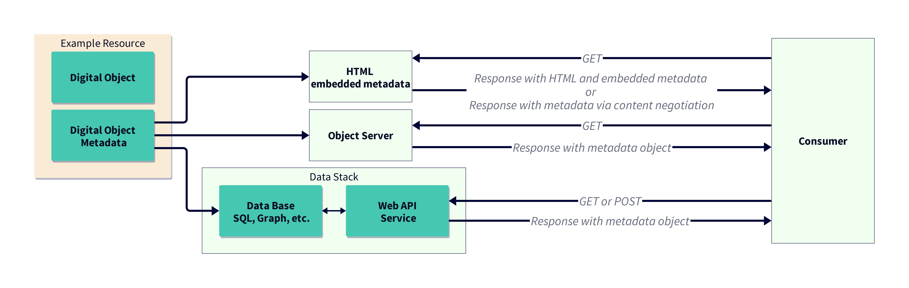

# API Reference

## About

This repo contains implementation details based on the NIH/NIAID Blueprint document titled: [A Blueprint for Including Digital Objects in the NIAID Data Ecosystem](https://docs.google.com/document/d/1y4Jzka6bcIZ_8yyxsJnOxGYrrRrqXv3n21sLJIZNUss/edit?tab=t.0#heading=h.3r4b53mh0wp9).

The goal is to provide a reference technical implementation for those interested in implementing the guidance in the Blueprint.

For reference, the key elements of the Blueprint are described below.

### Motivation

The NIAID repository landscape includes a variety of data systems supporting metadata access for researchers or their tools. These range from systems with little or no metadata access to those with Application Programming Interfaces (APIs) and other computational tools. Although systems do not need to be the same to work together, aligning NIAID repositories to a common standard will maximize the findability of metadata from all research areas to support data discovery and reuse.

### Blueprint Requirements

As with other sections of the Blueprint, API recommendations are designed to be customized during the implementation phase to address the needs of each repository in exposing their metadata for human or machine access. For example, if a repository or data generator is not able to develop an API, they can add HTML with embedded metadata, or a downloadable index of the metadata in a computer-accessible format (Fig. 1). On the other end of the spectrum, repositories with advanced API infrastructure could develop complementary services, such as a queryable metadata knowledge graph. Any of these options would enable a data provider to expose resources in a manner that facilitates metadata collection and aggregation.



Figure 1. Illustration of how metadata can be exposed through an API with various workflows, from the resource to the consumer.  

For standardized machine access to metadata, APIs should expose metadata elements described in Table 1. In general, an API should meet these minimum goals:

* Metadata Encoding: API responses should return metadata encoded in JSON-LD, at least as an option. This would follow the types and properties guidance in the minimal metadata specification above.
* IRI (URL) Structure: API endpoints should be designed as resource-oriented IRIs (e.g., /datasets/{dataset_id}), avoiding verbs and complex query parameters in the IRI structure. This ensures that the IRIs can function as persistent identifiers (IRIs) within the JSON-LD @id field, enabling seamless integration into knowledge graphs.
* HTTP Method: Metadata retrieval should be performed using the HTTP GET method.
* Documentation: API documentation should adhere to OpenAPI/Swagger specifications for machine-readability and ease of use.

Examples of the JSON-LD encoding can be seen in:

* docs/example1.json
* docs/example2.json


### Impact

The minimal API specification in the NIAID Blueprint would significantly improve the NIAID data ecosystem as a robust, scalable method for sharing metadata about NIAID digital objects. For example, the API standard would facilitate the creation of metadata catalogs and resource graphs, enhance the NIAID Data Ecosystem Discovery Portal, and enable integration with other cataloging services and data-driven workflows. The result would be a more sustainable, transparent, and user-friendly data architecture, empowering researchers to leverage NIAID data more effectively.

## Audience

The API reference implementation is intended for developers and data managers who are interested in implementing the NIAID Blueprint recommendations.


## Approaches

### API Implementation

The API implementation approach should follow the guidelines outlined in the Blueprint, with a focus on providing a standardized and machine-readable interface for accessing metadata. This includes adhering to the JSON-LD encoding and IRI structure recommendations, as well as using the HTTP GET method for metadata retrieval. API documentation should be provided in OpenAPI/Swagger format for ease of use and machine-readability.

## Repository Setup

This repository uses uv.  To install uv, reference: https://docs.astral.sh/uv/getting-started/installation/

After that something like:

```bash
uv init 
uv venv .venv --python 3.12
uv pip install -r requirements.txt
```

