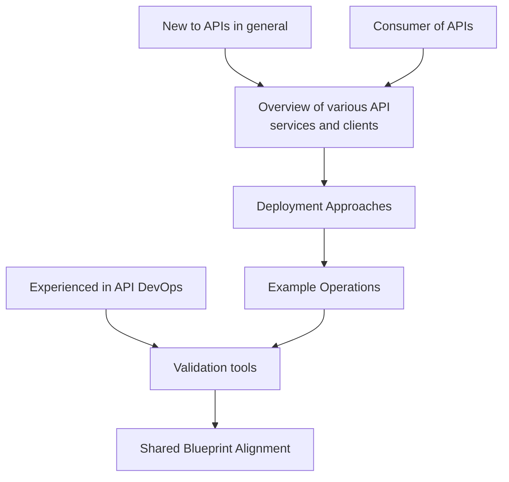

# Documentation


## Notes

There are potentially several paths and entry points for implementing the API recommendations.

We will want to accommodate different levels of expertise and provide guidance for each path.  The following diagram illustrates the different paths and entry points.

Note shown here is the concept of MCP that should be addressed as an additional concept.




## Scratch Pad

Here is the content of the "API Notes" document converted into Markdown format:

---

Web-based APIs are the "messengers" of the modern internet. They allow different software systems—like your phone’s weather app and the weather bureau’s database—to talk to each other and share data.

I'll guide you through both using and creating them. Let's start with a high-level look at how they function.

### How Web APIs Work 🌐

Most web APIs follow a Request-Response model. Think of it like a restaurant:

* **The Client (You)**: You are the customer who wants a specific dish (data).


* **The API**: This is the waiter. You give them your order, and they take it to the kitchen.


* **The Server (The Kitchen)**: This is where the data lives. It prepares your "order" and gives it back to the waiter.


* **The Response**: The waiter brings the food back to your table.


### Key Concepts to Know

* 
**Endpoints**: These are the specific web addresses (URLs) where you send your requests (e.g., `https://api.example.com/users`).


* **HTTP Methods**: These tell the server what action you want to take:


* **GET**: "Give me some data." 


* **POST**: "Here is new data; please save it." 


* **PUT**: "Update this existing data." 


* **DELETE**: "Remove this data." 


* **JSON**: The most common "language" or format used to exchange data. It looks like a list of labels and values (e.g., `{"name": "Alice", "age": 25}`).


---

### Phase 1: Documentation Discovery and Initial Assessment

* **2.1 Identifying Publicly Available API Documentation**: The initial phase involves locating and assessing available documentation, often found in sections labeled "Developers," "API," or "Docs".


* **2.2 Locating and Retrieving OpenAPI/Swagger Specifications**: Look for standardized machine-readable descriptions like OpenAPI or Swagger files (often `.json` or `.yaml`).


### Phase 2: Core API Functionality Examination

* **3.1 Analyzing Content Negotiation Capabilities**: Use tools like `curl` to test how the server handles different `Accept` headers (e.g., `application/json`, `application/xml`).


* **3.2 Investigating Structured Data on the Web**: Check HTML source for `<script type="application/ld+json">` blocks to find embedded JSON-LD data.


### Phase 3: Deep Dive into API Structure and Authentication

* **4.1 Dissecting OpenAPI/Swagger Documentation**: Analyze the `paths`, `components`, and `security` sections to understand endpoints and reusable schemas.


* **4.2 Exploring Authentication Mechanisms**: Identify if the API uses API keys, OAuth 2.0, or HTTP Basic Authentication.


### Phase 4: Data Interaction and Response Analysis

* **5.1 Constructing and Executing API Requests**: Use `curl` with flags like `-H` for headers and `-X` for methods to interact with the API.


* **5.2 Analyzing API Response Structure and Content**: Examine HTTP status codes (e.g., 200 OK) and validate the response body against the documented schema.


### Phase 5: Leveraging Open-Source Tools

* **6.1 Utilizing jq**: A command-line JSON processor for filtering and transforming API responses.


* **6.2 Employing xmllint**: A tool for parsing and validating XML responses.


* **6.3 Other Tools**: Includes `httpie`, Postman CLI (Newman), and `openapi-spec-validator`.


---

### Python Example: Building a Basic Client

To build a client in Python, use the `requests` library:

```python
import requests

# 1. Define the address (The Endpoint)
url = "https://jsonplaceholder.typicode.com/todos/1"

# 2. Send the "GET" request
response = requests.get(url)

# 3. Check if it worked (Status Code 200 means Success)
if response.status_code == 200:
    # 4. Convert the raw text into a Python Dictionary (JSON)
    data = response.json()
    print(data)
else:
    print(f"Error: {response.status_code}")

```

Look closely at the code above. Before we run it (or if you just ran it in your head), think about that response.json() line.
If the server sends back a piece of data that looks like this:

```json
{"userId": 1, "id": 1, "title": "delectus aut autem", "completed": false}
```

How would you write a line of code to print only the title of the task? (Hint: Think about how you access values in a Python dictionary).
To print only the title of the task, you can use the following line of code:

```python
print(data['title'])
```

This line accesses the 'title' key within the dictionary and prints its corresponding value.


