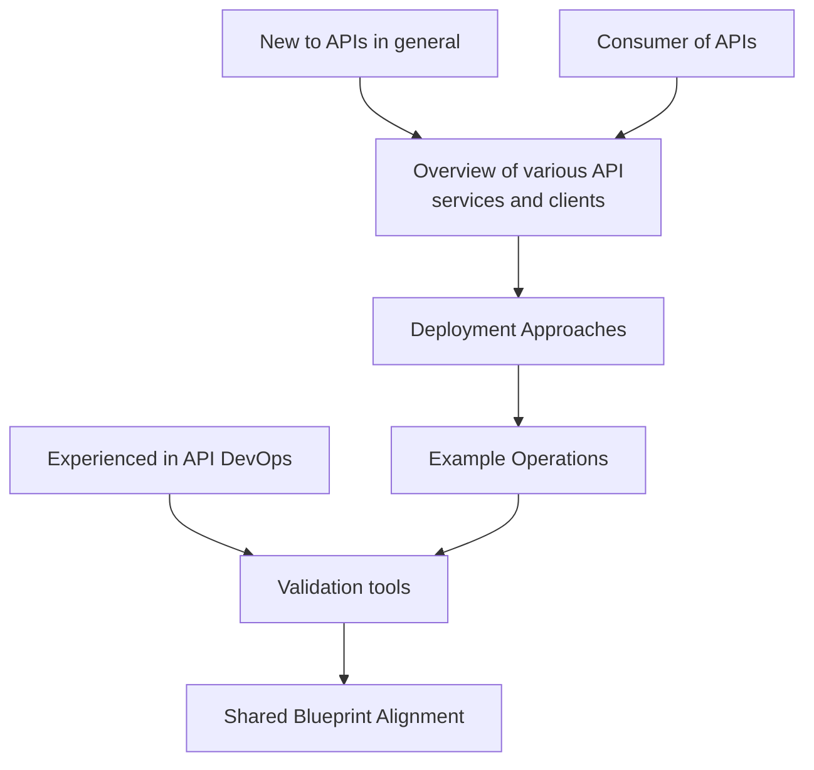

# Documentation

## Notes

There are potentially several paths and entry points for implementing the API recommendations.

We will want to accommodate different levels of expertise and provide guidance for each path.  The following diagram illustrates the different paths and entry points.

Note shown here is the concept of MCP that should be addressed as an additional concept.

