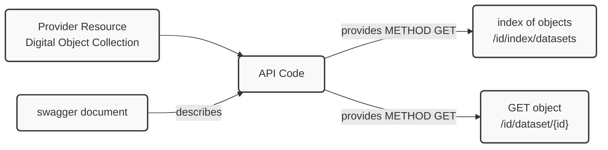
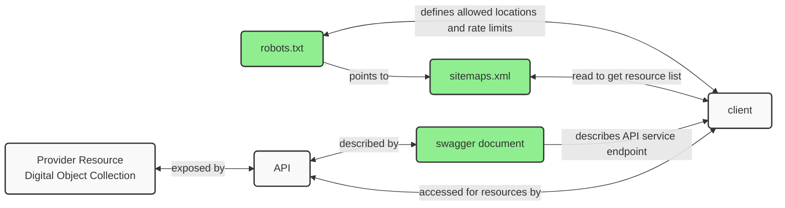
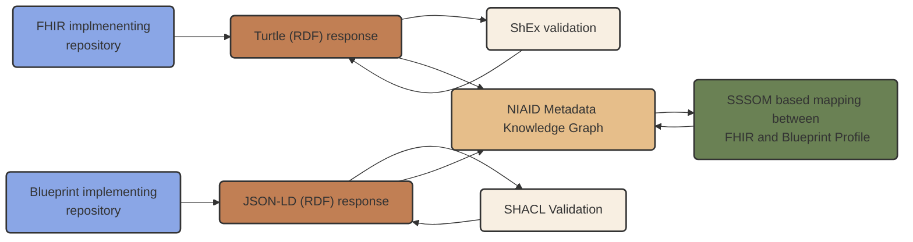

## Response Package

Before we talk about APIs or document URLs, we will address the response package that will be returned.  The Blueprint presents an approach where the response package is modeled in RDF and encoding in JSON-LD. This is similar to the optional FHIR response pattern using RDF and Turtle referenced in the [FHIR Interoperability](#fhir-interoperability) section below. 

Details of this encoding can be seen in the section __Supplemental Table 7. Example JSON-LD Encodings__ on page 23 of [A Blueprint for Including Digital Objects in the NIAID Data Ecosystem](https://docs.google.com/document/d/1y4Jzka6bcIZ_8yyxsJnOxGYrrRrqXv3n21sLJIZNUss/edit?tab=t.0#heading=h.3r4b53mh0wp9).

For developers, the best resource is the main reference site at [https://json-ld.org/](https://json-ld.org/). From there you can find libraries for most of the popular languages as well as an [interactive playground](https://json-ld.org/playground/) where you can play with editing JSON-LD or paste in examples from the Blueprint, this repo or others to explore with.  

Additionally, validation tools exist and are covered in the [SHACL Validation for Blueprint Profile](#shacl-validation-for-blueprint-profile) section later.  

## Reference Implementation Approach

The Blueprint presents a web architecture based approach to facilitate ease of implementation and scaling.  Some groups may have established API ecosystems and development and support resources in place already.  That case will be addressed later.  

For those starting fresh, this is an introduction.  The basic approach would be the establishment of an API/URL that can deliver the appropriate response package.

### Minimal Methods and Patterns

As this Blueprint describes a read-only pattern, the only HTTP verb we will be dealing with is GET.  This means any compliant service does need to expose things like POST, PUT, HEAD or any of the others.   

Given this, a minimum viable product (MVP) approach might look something like this.

First, we will want some ability to expose a catalog of the resources we want to have indexed.  A more architectural approach to this will be shown shortly in the [Additional Architectural Elements](#additional-architectural-elements) section.  However, we could also do this as an API call.    

Let's establish a set of URL patterns for our implementation.

``` 
/id/index/datasets
/id/dataset/{id}
```

Here we have used the prefix ```/id/``` simply to set this URL apart from the rest of our domain namespaces for URLs.   This is optional, and if you are using a top-level unique domain like api.example.org, then it wouldn't even be necessary.   For this document we will keep it. 

Visually, this is something like:



This collection of digital objects might be a GitHub repository, S3 objects store, Relational Database or any type of document/resource management approach.


#### Example

A simple Python program is provided to explore some of these commands locally if desired. This repo uses the [uv](https://docs.astral.sh/uv/) command to manage the Python environment.   You can 
[install uv](https://docs.astral.sh/uv/getting-started/installation/) and then use the commands that follow in this document.

Move to the _server_ directory and run:

```bash
uv run main.py
```

you should see something like:

```bash
(.venv) ➜  server git:(master) ✗ uv run main.py                                
Server listening on port 8080
 * Serving Flask app 'main'
 * Debug mode: off
WARNING: This is a development server. Do not use it in a production deployment. Use a production WSGI server instead.
 * Running on all addresses (0.0.0.0)
 * Running on http://127.0.0.1:8080
 * Running on http://192.168.202.58:8080
Press CTRL+C to quit
```


#### Catalog

We would use 

```
/id/index/datasets
```

To get a set of resources we wish to index. Note; it is possible this could be quite large depending on how you, as an organization, have decided to expose your resources.  The __unit__ or __quantization__ of your resources might be quite fine or course depending on the use cases for your community.   If this set it large, it might be challenging for an API to dynamically respond to, and so you may wish to build this and provide it as a static pre-computed resource.  In that case you may want to use a sitemap as described in the following [Additional Architectural Elements](#additional-architectural-elements) section.

We can then see we can use a simple curl call like:

```bash
➜  apireference git:(master) ✗ curl http://192.168.202.58:8080/id/index/datasets
["http://127.0.0.1:8080/id/dataset/1","http://127.0.0.1:8080/id/dataset/3"]
```

Here the valid URLs are expressed with a localhost IP (127.0.0.1) so this will only work on your 
local machine.  

> Note: A simple list like shown above carries no semantics. Better would be to return either a 
> sitemap XML document or a schema.org type DataCatalog document.

#### GET resource

This leaves us to implement the request for a document. We will work the http://127.0.0.1:8080/id/dataset/1 
returned above.  At this point we are issuing a simple GET request for a resource that follows the pattern:

``` 
/id/dataset/{id}
```
As a means to get a dataset.   Note that there is nothing rigid about this approach. The URL path could vary, and you might be exposing URLs with various extensions or patterns used by your community already.  

So patterns like

``` 
/id/dataset/1
/id/dataset/1.json
/id/dataset/1?mode=jsonld
```

are all valid.

An example curl here, which defaults to method GET, follows.

```bash
➜  apireference git:(master) ✗ curl http://192.168.202.58:8080/id/dataset/1     
{
  "@context": "https://schema.org",
  "@type": "Dataset",
  "name": "Sample Dataset",
  "description": "This is a sample dataset."
}
```

Note if we look at our headers,  we can do something like

```bash
➜  apireference git:(master) ✗ curl -v http://192.168.202.58:8080/id/dataset/1 -o /dev/null
 
 ...
 
* Connected to 192.168.202.58 (192.168.202.58) port 8080
* using HTTP/1.x
> GET /id/dataset/1 HTTP/1.1
> Host: 192.168.202.58:8080
> User-Agent: curl/8.12.1
> Accept: */*
> 
* Request completely sent off
< HTTP/1.1 200 OK
< Server: Werkzeug/3.1.3 Python/3.13.1
< Date: Wed, 16 Jul 2025 16:24:13 GMT
< Content-Disposition: inline; filename=1.json
< Content-Type: application/ld+json
< Content-Length: 133
< Last-Modified: Sun, 13 Jul 2025 13:46:44 GMT
< Cache-Control: no-cache
< ETag: "1752414404.2917662-133-2897417769"
< Date: Wed, 16 Jul 2025 16:24:13 GMT
< Connection: close
< 
```

Here we see both the request and response headers.  Note the "Content-Type: application/ld+json" in the response header.  We could also configure out API service to content negotiate on the "Accept" header and allow our single URL to provide for various content types.  Such as being both a default HTML representation and a negotiated application/ld_json representation.  


### OpenAPI / SWAGGER

The application [main.py](./server/main.py) is described by the OpenAPI document [localExample.yaml](descriptionDocs/localExample.yaml).   This provides a nice guide for those looking to implement an API to reference.  

It is also possible to validate your swagger document with tools like 
https://validator.swagger.io/.


### Additional Architectural Elements

There are some additional approaches 


#### robots.txt

OPTIONAL: Providers may decide to generate or modify their robots.txt file to provide guidance to the aggregators. The plan is to use the Gleaner software (gleaner.io) as well as some Python-based notebooks and a few other approaches in this test.


```
Sitemap: https://samples.earth/sitemap.xml

User-agent: *
Crawl-delay: 4
Allow: /

User-agent: Googlebot
Disallow: /id

User-agent: EarthCube_DataBot/1.0
Allow: /
Sitemap: httpss://example.org/sitemap.xml
```

#### sitemaps

Providers will need to expose a set of resource landing pages using a sitemap.xml file. As noted above, providers can expose a sitemap file to just the target agent to avoid indexing test pages by commercial providers. You may wish to do this during testing or for other reasons. Otherwise, a sitemap.xml file exposed in general from somewhere in your site is perfectly fine.

Information on the sitemap structure can be found at sitemaps.org.

generic sitemap
```xml
<?xml version="1.0" encoding="UTF-8"?>
<urlset xmlns="https://www.sitemaps.org/schemas/sitemap/0.9">
   <url>
      <loc>https://example.org/landingpage1</loc>
      <lastmod>2024-06-10</lastmod>
      <changefreq>monthly</changefreq>
   </url>
   <url>
      <loc>https://example.org/landingpage2</loc>
      <lastmod>2024-01-31</lastmod>
      <changefreq>monthly</changefreq>
   </url>  
</urlset> 
```

It is encouraged to use the sitemap <lastmod> parameter to provide guidance to indexers on page updates. You can also add the <changefreq> parameter for how often you expect records in your sitemap to change this will tell systems like ODIS how often to reindex your holdings - possible values are: always, hourly, daily, weekly, monthly, yearly, never. Additionally, indexers may test ways to evaluate additions and removals from the sitemap URL set to manage new or removed resources.

A sitemap file would look like the following.

sitemap index
```xml
<?xml version="1.0" encoding="UTF-8"?>
<sitemapindex xmlns="https://www.sitemaps.org/schemas/sitemap/0.9">
   <sitemap>
      <loc>https://example.org/sitemap_a.xml</loc>
      <lastmod>2024-06-10</lastmod>
   </sitemap>
   <sitemap>
       <loc>https://example.org/sitemap_b.xml</loc>
      <lastmod>2024-01-01</lastmod>
   </sitemap>
</sitemapindex>
```



In the above diagram we can see the documents discussed here (in green) that can be added to our server to provide guidance and efficiency to the process.  


One advantage of this approach is that is a common pattern used by other aggregation services.  The largest among these is like the Google Dataset Search services.  If you establish a sitemap.xml referencing your resources, you can submit it to Google so that your resources are also indexed in their service.  

## Established Service Providing Communities

For those with established API architectures, much of this is likely very basic.  

### Response alignment

Like approaches in FHIR, MLCommons Croissant and Google Dataset Search, the Blueprint
advocates a response that is application/ld+json leveraging the schema.org vocabulary.

So, existing providers of APIs, to align, would need to:

1) Provide some endpoint that is RESTful compliant and returns JSON-LD algined with the Blueprint schema. Note that we will generate and provide a SHACL shape that can be used to check this programmatically.  See the section [SHACL Validation for Blueprint Profile](#shacl-validation-for-blueprint-profile).
2) Export a list of resources to be indexed.  Either as the result of an API call or via the sitemap approach.  See the sitemap section of the [Additional Architectural Elements](#additional-architectural-elements) section.  


## FHIR Interoperability

Those implementing the [H7 FHIR](https://www.hl7.org/fhir/) are already well aligned to the blueprint.

The H7 FHIR specification has a [RDF based turtle encoding](https://www.hl7.org/fhir/rdf.html) option 
as well as a [ShEx based validation document](https://www.hl7.org/fhir/fhir.shex).

A comparison on the Blueprint approach and the RDF-based FHIR approach is seen below.  (detail this, look at the FHIR API patterns and compare to the ones in the blueprint)



Note that while it is easy to mix RDF graphs in a triplestore that doesn't mean that recovery across the various vocabularies (ontologies) is easily done in query space.  However, if an effort was taken on to map between them with something like [SSSOM](https://mapping-commons.github.io/sssom/) this could be addressed.  Such an approach is outside the scope of this document to address. 


## SHACL Validation for Blueprint Profile

Since the response package is RDF in JSON-LD, we can leverage approaches like ShEx and SHACL to validate these data graphs with.  While FHIR uses ShEX, we have opted to use the W3C SHACL approach.  An example SHACL file can be seen in the shapegraphs directory.  The file [googleRequired.ttl](./shapegraphs/googleRequired.ttl) can be used to validate graphs with.

This SHACL shape is designed to validate schema.org Dataset for only URL, name and description.  A popular and standard compliant implementation of SHACL is [pySHACL](https://github.com/RDFLib/pySHACL).

Once installed, it will expose a command line tool that you can use like the following

```bash
pyshacl -s googleRequired.ttl -sf turtle -df json-ld -f table ./data/1.json
```

```bash
pyshacl -s https://provisium.io/api/googleRequired.ttl -sf turtle -df json-ld -f table ./data/1.json
```

As a library, it is also possible to use it more programmatically to check resources in a triplestore, for example.  


## Future Directions

I didn't get to this section, but topics like MCP and more about the briefly mentioned MLCommons Croissant work would likely be useful.  
 