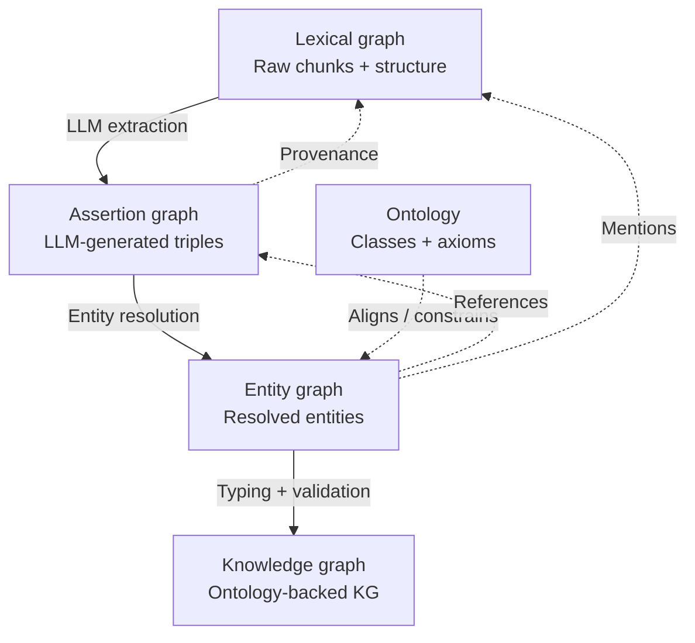

## Note on Terminology and Architecture for Extracted Knowledge Structures

> Some additional thoughts on the approach discussed in the recent call put into a more 3rd person format.

There is a meaningful distinction between extracted claims/assertions and a true Knowledge Graph. The extracted resources in question are LLM-generated triples or statements. While it is perfectly valid to store these as nanopublications and link them into a larger structure as nodes (essentially functioning as typed assertions), parties might want to be cautious referring to them directly as “knowledge” or as a Knowledge Graph.

These LLM-derived resources are more accurately described as an **LLM-augmented knowledge base** or **synthetic knowledge base**. When stored as triples in a triplestore, this layer can reasonably be called an **Assertion Graph** — particularly if constructed in the absence of a formal ontology.  _more on that later_

It is assumed that these assertions are being generated from a set of extracted document chunks. This chunk layer, along with the structural relationships between documents, pages, paragraphs, and chunk sequences, constitutes what is commonly referred to as a **Lexical Graph**. The Lexical Graph provides the necessary provenance back to the original source material.

Logical layering for this type of work might look something like:

- **Lexical Graph**: Raw document chunks plus their structural relationships (logical parsing of source documents).  
- **Assertion Graph**: LLM-generated statements/triples (discrete or atomic facts), often stored as nanopublications and linked back to the lexical chunks.  
- **Entity Graph**: Resolved unique entities together with their normalized relationships, preferably extracted or aligned using a controlled vocabulary or ontology.  
- **Ontology**: Formal classes, properties, and axioms that provide structure and constraints to the Entity Graph where possible.  
- **Knowledge Graph**: The resulting ontology-aligned, high-confidence structure.

> NOTE: Not shown here, and I likely should, is the curated metadata graph.  The graph that is formed from the vetted and published metadata.  It, too, would have connections to the ontology (or many) and the entity graph.  It along with the ontolgies is likely your human touched ground truth.

In this model, the Assertion Graph feeds into the Entity Graph through entity resolution and relation normalization. The Entity Graph is then aligned with the Ontology, while maintaining traceable links back to the Lexical Graph for provenance.

This approach also maps well to the Blueprint architecture. If the Scripps work leverages existing ontology or vocabulary elements when constructing the Entity Graph, it would represent good practice and improve consistency, interoperability, and reasoning capability across the system.

> Note: Recent comments in the slack thread about existing metadata approaches to this assertion type are worth considering.  