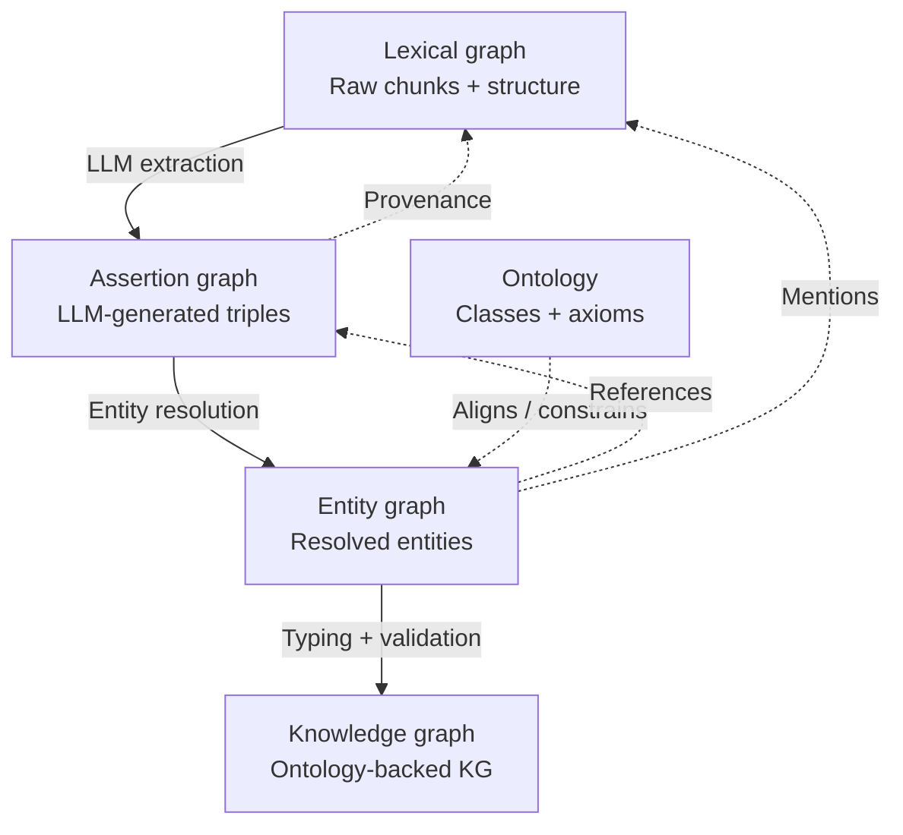

## Note on Terminology and Architecture for Extracted Knowledge Structures

Some additional thoughts on the approach discussed in the recent call.
### **Subject: Architectural Observations Regarding Knowledge Graph Development and Implementation**

The following observations outline a formal perspective on the current technical trajectory regarding extracted claims and their integration into a broader knowledge architecture.

### **Conceptual Distinctions in Graph Structure**
There is a critical distinction to be made between LLM-generated assertions/triples and a formal **Knowledge Graph (KG)**. While extracted assertions are valuable, they are more accurately categorized as components of a **Synthetic** or **LLM-Augmented Knowledge Base**. 

In the absence of a governing ontology, these extracted resources function as an **Assertion Graph**. To ensure data integrity and provenance, it is recommended that these claims be treated as "nanopublications"—discrete type assertions that are subsequently linked into a proper KG structure rather than serving as the structure itself.

### **Proposed Knowledge Hierarchy**
To ensure clarity across the community, the following "food chain" of graph topology is proposed:

* **Lexical Graph:** The foundational layer consisting of logical document parsing (chunks + structure). This maps the topology of the sources, such as a sequence of (Document $\rightarrow$ Page $\rightarrow$ Paragraph).
* **Entity Graph:** A layer of resolved entities and relationships extracted from the Lexical Graph. This should ideally leverage controlled vocabularies to ensure consistency.
* **Ontology:** The formal framework of classes, properties, and axioms that governs the Entity Graph.
* **Assertion Graph:** The repository of discrete, atomic facts. 

In a robust architecture, the **Assertion Graph** is linked via the **Entity Graph** back to the raw source text (**Lexical Graph**). This ensures that every synthetic claim is grounded in primary source material and aligned with the overarching **Ontology**.

---

### **Blueprint Alignment**
The approach currently discussed aligns well with the established NIAID Blueprint for data architecture. The value of this approach is amplified when it leverages standardized **Ontology and Vocabulary** elements, as these provide the necessary semantic rigor for long-term scalability and interoperability.  Additional PIDs enhance to approach.

There is a meaningful distinction between extracted claims/assertions and a true Knowledge Graph. The extracted resources in question are LLM-generated triples or statements. While it is perfectly valid to store these as nanopublications and link them into a larger structure as nodes (essentially functioning as typed assertions), referring to them directly as “knowledge” or as a Knowledge Graph can be misleading.

These LLM-derived resources are more accurately described as an **LLM-augmented knowledge base** or **synthetic knowledge base**. When stored as triples in a triplestore, this layer can reasonably be called an **Assertion Graph** — particularly when constructed in the absence of a formal ontology.

It is assumed that these assertions are being generated from a set of extracted document chunks. This chunk layer, along with the structural relationships between documents, pages, paragraphs, and chunk sequences, constitutes what is commonly referred to as a **Lexical Graph**. The Lexical Graph provides the necessary provenance back to the original source material.

A logical layering for this type of work is as follows:

- **Lexical Graph**: Raw document chunks plus their structural relationships (logical parsing of source documents).  
- **Assertion Graph**: LLM-generated statements/triples (discrete or atomic facts), often stored as nanopublications and linked back to the lexical chunks.  
- **Entity Graph**: Resolved unique entities together with their normalized relationships, preferably extracted or aligned using a controlled vocabulary or ontology.  
- **Ontology**: Formal classes, properties, and axioms that provide structure and constraints to the Entity Graph where possible.  
- **Knowledge Graph**: The resulting ontology-aligned, high-confidence structure.

In this model, the Assertion Graph feeds into the Entity Graph through entity resolution and relation normalization. The Entity Graph is then aligned with the Ontology, while maintaining traceable links back to the Lexical Graph for provenance.

This approach also maps well to the Blueprint architecture. If the Scripps work leverages existing ontology or vocabulary elements when constructing the Entity Graph, it would represent good practice and improve consistency, interoperability, and reasoning capability across the system.