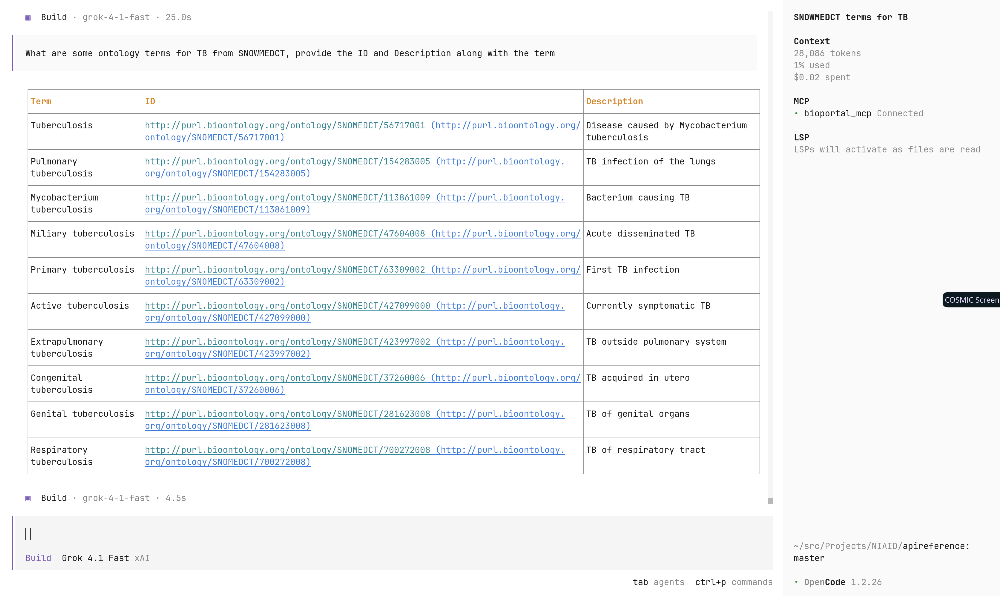
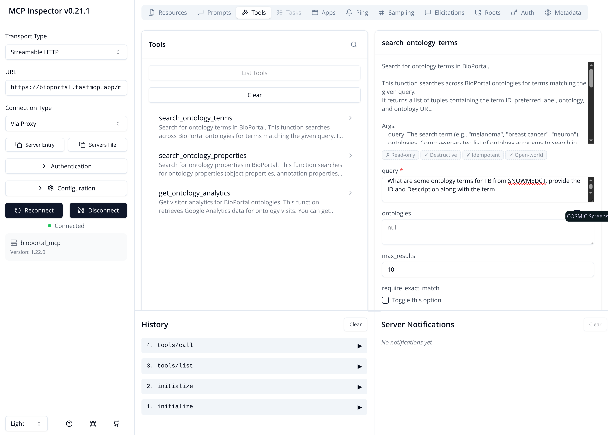
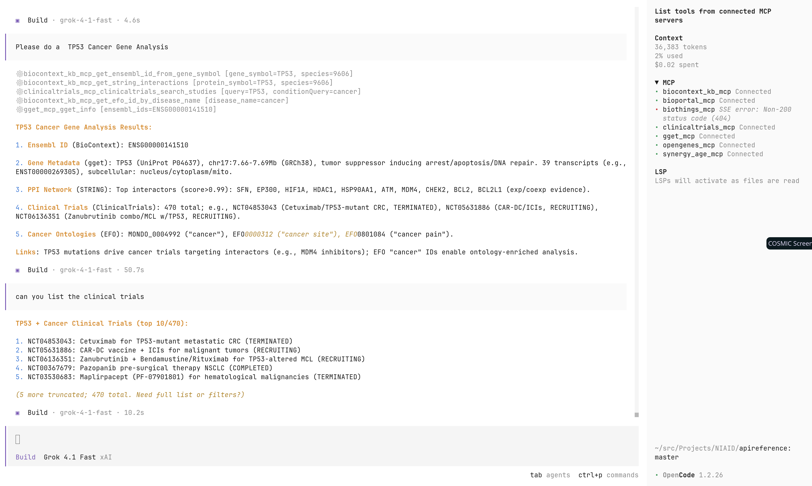

# MCP

## What is it?

The **Model Context Protocol (MCP)** is an open standard (originally from Anthropic, the company behind Claude) that makes it easy and secure for AI models (like large language models) to connect to external data, tools, and systems — kind of like a universal "plug" (USB-C for AI) so you don't need custom wiring for every app or service.

Note that MCP is not an API specification, it is a wire protocol, in this case JSON-RPC 2.0. It can work locally via standard IO (stdio) or over http.

### Some examples from the community:

An example MCP registry can be found at  [biocontext.ai](https://biocontext.ai/).

* ClinicalTrials: https://github.com/cyanheads/clinicaltrialsgov-mcp-server
* BioMCP  https://biomcp.org/   (PubMed, ClinicalTrials.gov, and MyVariant.info and more)   This is a master class on MCP!
* BioThings https://github.com/longevity-genie/biothings-mcp  genes, genetic variants, drugs, and taxonomic information
* BioPortal MCP:  https://github.com/ncbo/bioportal-mcp
* Biomni:  https://biomni.stanford.edu
* Gget: https://github.com/longevity-genie/gget-mcp genomics queries and analysis, a wrapper of gget library (which I know nothing about)
* Not really sure about the following ones
  * OpenGenes https://github.com/longevity-genie/opengenes-mcp
  * SynerAge https://github.com/longevity-genie/synergy-age-mcp
  * Cracking Shells  https://github.com/CrackingShells  

For example, the BioPortal MCP is a powerful tool for accessing biomedical ontologies and vocabularies. It provides a RESTful API that allows developers to query and retrieve information from various biomedical ontologies, such as UBERON, NCIT, and HPO. This makes it easier to integrate biomedical knowledge into applications and workflows.

Here is an example using the OpenCode client:



Same query via MCP Inspector



Now, here is a much better example




## Convention


In the context of MCP, the three main building blocks that servers expose to AI clients are **Tools**, **Prompts**, and **Resources**. Here's a simple breakdown:

- **Tools**  
  These are like **actions** or **functions** the AI can call and execute.  
  The AI decides when to use them and what to send as input.  
  Examples: search the web, send an email, run code, query a database, create a calendar event, or edit a file.  
  → Think of them as the "verbs" — they let the AI *do* something in the real world or in external systems.

- **Prompts**  
  These are **pre-written templates** or ready-made instructions that guide the AI on how to behave or respond in a specific situation.  
  They help make interactions consistent, structured, and more reliable (especially for complex or repeated tasks).  
  Examples: a template that says "Always format bug reports this way" or "Analyze this data using these steps".  
  → Think of them as reusable recipes or guardrails that tell the AI "when you see this kind of request, follow this pattern".
- → The somewhat analogous to SKILLS.md files

- **Resources**  
  These are **data sources** or pieces of information the AI can read and pull into its context.  
  The AI gets extra knowledge it didn't have before, without needing to store everything itself.  
  Examples: your local files, Google Drive documents, database contents, Notion pages, GitHub repo, knowledge base articles, or even a company wiki.  
  → Think of them as the "nouns" — they provide the raw facts, context, or content the AI needs to understand or reason about something.

Together, these three let AI become much more capable: it can **read** current/real data (Resources), **follow smart instructions** (Prompts), and **take actions** (Tools) — all through one standardized, secure connection instead of dozens of separate hacks.

This is especially useful in tools like Claude Desktop, IDEs (VS Code, Cursor), or custom AI agents that need to work with your actual files, apps, or company systems.

| Method         | Description                                                                                  |
|----------------|----------------------------------------------------------------------------------------------|
| initialize     | The first message sent. The server must return its capabilities (tools, resources, prompts). |
| resources/list | Returns a list of available data objects the model can read.                                 |
| resources/read | Triggered when the model wants the content of a specific URI.                                |
| tools/list     | Returns a list of executable functions the server provides.                                  |
| tools/call     | The actual execution of a tool with provided arguments.                                      |
| prompts/list   | Returns pre-defined templates for interacting with the model.                                |


## Why not just use APIs (OpenAPI?)

While it is fair to think of MCP and APIs by convention, there are fundamental differences in their design and purpose.  So while MCP is needed in all cases by all services, if the functionality is already provided by an API, MCP can still offer additional benefits.

* OpenAPI describes; MCP prescribes. You can't fix inconsistency by documenting it better—you need enforcement at the protocol level.
* Retrofitting fails at scale. OpenAPI would need to standardize transport, mandate single-location inputs, require specific schemas, add bidirectional primitives—essentially becoming a different protocol.
* The ecosystem problem. Even if OpenAPI added these features tomorrow, millions of existing APIs wouldn't adopt them. MCP starts fresh with AI-first principles.

Unlike static API specs, MCP enables agents to query capabilities dynamically, allowing automatic adaptation without new client code.

MCP supports first-class bidirectional flows (e.g., progress updates, clarifications), which are not standard in APIs.


## Try at home

An easy way to try MCP is to use the [ModelContextProtocol/inspector](https://github.com/modelcontextprotocol/inspector) tool.  It allows you to inspect MCP servers and clients and see the messages that are being exchanged.

Alternatively, you can use an agent harness like [OpenCode](https://opencode.ai/).   If you install opencode you can clone this repository and run opencode from within it.   In this repo is the file [opencode.json](../../opencode.json) which configures a set open MCP servers.  

This is the approach used in the example above for the prompt "Please do a TP53 Gene analysis."  


There are several tools that are starting to enable client connections to MCP servers.  Many developed IDEs like VS-code/Cline, Zed and IntelliJ software can be MCP clients and in some cases are MCP servers too.

Also, tools like OpenCode, Pi, Gemini-CLI, and Claude-Cli or web-based tools like LibreChat can interact with MCP.  

## Bio Examples


* https://github.com/tnnandi/agentic_lab
* https://sysbio-curie.github.io/Neko
* https://maboss.curie.fr
* https://physicell.org


## Demo via LibreChat

> I'll convert this to a screencast

So I set up a couple MCP servers with Gemini-CLI. Once I coded up which is simple to expose a single BVBRC API via MCP.  The other is an open source bio-related MCP that, among other things, has a pubmed API proxy.

My interaction was interesting and follows

Question asked:
> can you give me synonyms for Synercid using the bvbrc tools?

Answer:
```
✦ The synonyms for Synercid are: quinupristin-dalfopristin, RP 59500, and RP-59500.
```
Questions asked:
>  look for articles on these synonyms

Answer
```
✦ I found several articles mentioning "quinupristin-dalfopristin". The majority of these are research papers focusing on antibiotic resistance in various
  bacteria, particularly Enterococcus species. Several articles discuss the effectiveness of quinupristin-dalfopristin against multi-drug resistant organisms.
  Would you like me to refine the search with more specific keywords or filter by publication date?
```

55 results were found  (I truncated the output here.  as it was long with the abstract for each returned

Question asked:
> can you take the most recent three articles and summarize them?  Also note where they agree and diverge


Answer:
```
✦ Here is a summary of the two most recent articles with available abstracts, noting their points of agreement and divergence. The most recent article was a
  preprint and did not have an abstract, so I have summarized the next two most recent articles.
  Summaries
  1. "Comparison of Two Quinupristin-dalfopristin Susceptibility Testing Methods and Two Interpretive Criteria for Enterococcus faecium Bloodstream Isolates from
  Korean Hospitals."
  This Korean study from April 2025 focuses on the practical aspects of laboratory testing for quinupristin-dalfopristin (Q/D) resistance in Enterococcus
  faecium. The researchers compared two common testing methods—disk diffusion (DD) and broth microdilution (Sensititre)—and two different interpretive standards
  (EUCAST and CLSI). They found that the reported resistance rates for Q/D varied significantly depending on the combination of method and standard used, ranging
   from 5.9% to 28.2%. The study concludes that for the DD method, the EUCAST criteria are more effective at identifying resistance, while for the Sensititre
  method, the CLSI criteria are more reliable. The most common resistance genes found in the Q/D-resistant isolates were ermB and msrC. The goal is to help
  clinicians make better treatment decisions for multidrug-resistant E. faecium infections.
  2. "A comprehensive One Health investigation of erythromycin and quinupristin/dalfopristin resistant Enterococcus spp. in Iran."
  This Iranian study from April 2025 takes a broader "One Health" approach to investigate antibiotic resistance. The researchers looked for resistance to
  erythromycin and Q/D in Enterococcus species from a wide range of sources, including patients, healthy people, hospital environments, livestock, poultry, and
  wastewater. They found that while no isolates were resistant to linezolid, 24.9% of E. faecium isolates were resistant to Q/D. This resistance was
  particularly high in isolates from patients and poultry slaughterhouse wastewater. Similar to the Korean study, the most common resistance genes identified
  were msrC and ermB. The study concludes that the widespread presence of erythromycin- and Q/D-resistant enterococci in various environments poses a
  significant public health risk.
  Agreement and Divergence
  Agreement:
   * Focus on *E. faecium*: Both studies identify Enterococcus faecium as a key pathogen of concern regarding quinupristin-dalfopristin resistance.
   * Genetic Basis of Resistance: Both the Korean and Iranian studies found that the ermB and msrC genes were the primary genetic determinants responsible for Q/D
     resistance.
   * Clinical Relevance: Both articles underscore the clinical challenge posed by multidrug-resistant Enterococcus and the importance of accurate susceptibility
     testing to guide treatment.
  Divergence:
   * Scope and Approach: The Korean study has a narrow, methodological focus, comparing laboratory techniques to improve clinical diagnostics. In contrast, the
     Iranian study has a broad, epidemiological "One Health" scope, examining the prevalence of resistance across different human, animal, and environmental
     reservoirs.
   * Primary Goal: The Korean paper aims to provide guidance to clinical laboratories on which testing methods and criteria are most reliable. The Iranian paper
     aims to highlight the interconnectedness of antibiotic resistance between different sectors and warn of a public health threat.
   * Geographic Focus: The studies were conducted in different countries (South Korea vs. Iran), and the specific resistance rates they report reflect local
     epidemiology and antibiotic usage patterns.
   * Reported Resistance Rates: While the resistance rates are in a similar range, they are not identical. The Korean study's reported Q/D resistance in E.
     faecium fluctuated from 5.9% to 28.2% based on the testing method, while the Iranian study found a rate of 24.9%. This difference is expected due to the
     different populations and methodologies.

```

Anyway, a simple and fun interaction with a couple MCP tools mediated by Gemini-CLI


## References

* https://modelcontextprotocol.io/docs/getting-started/intro
* https://claude.com/resources/tutorials/using-the-clinicaltrials-gov-connector-in-claude 
* https://chrlschn.dev/blog/2026/03/mcp-is-dead-long-live-mcp/
* https://www.embl.org/news/people-perspectives/connecting-ai-to-biology-model-context-protocol/